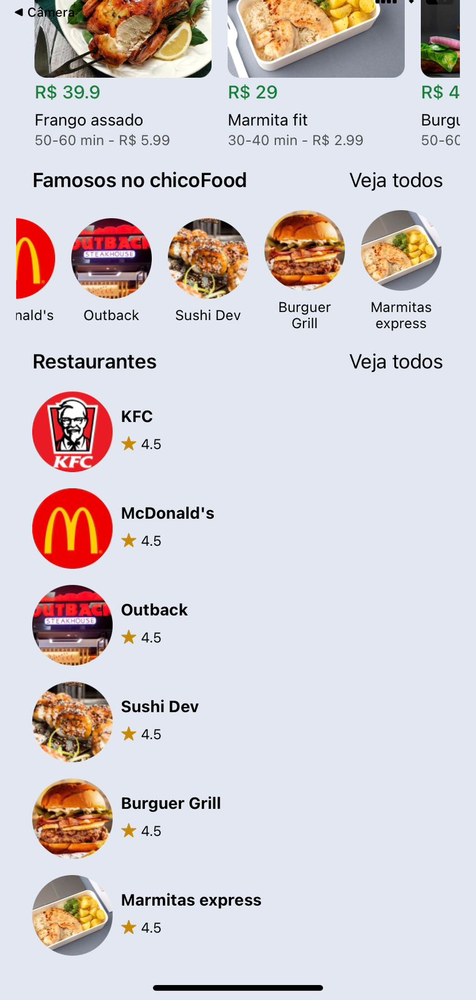

# Clone da Página Inicial do iFood

Este é um projeto que reproduz a página inicial do iFood, criado com React Native e estilizado com NativeWind. O projeto serve como uma prática para o uso de componentes e estilização em React Native, sem funcionalidades ou navegação adicional.
<p align="center">
    
    &nbsp;&nbsp;&nbsp;&nbsp; <!-- Isso adiciona quatro espaços -->
    
</p>

## Funcionalidades
- Interface da página inicial do iFood.
- Exibição de imagens e textos.
- Estilização utilizando NativeWind.

## Tecnologias Utilizadas
- **React Native**
- **NativeWind** para estilização
- **Expo Go** para emulação
- **Ionicons** para ícones
- **JSON Server** para dados simulados (db.json)

## Configuração do Ambiente

### Pré-requisitos

Certifique-se de ter instalado:
- **Node.js** e **npm**
- **npx** para execução de comandos
- **Expo Go** (instalado no dispositivo móvel ou emulador)
- **JSON Server** para servir os dados

### Passo a Passo para Rodar o Projeto

1. **Clone o repositório**:

    ```bash
    git clone https://github.com/chicofgdl/chicoFood.git
    cd ifood-clone
    ```

2. **Instale as dependências**:

    ```bash
    npm install
    ```

3. **Configure o endereço IP**: Em algumas partes do código, é necessário atualizar o endereço `localhost` para o IP da sua máquina:
    
    - Em `ifood-clone/src/components/Restaurants/index.tsx`
    - Em `ifood-clone/src/components/RestaurantsList/index.tsx`
    - Em `ifood-clone/src/components/Trending/index.tsx`
    
    Substitua `localhost` pelo seu endereço IPV4 local. Para encontrar o IP, abra o terminal e digite:

    ```bash
    ipconfig
    ```
    
    No resultado, localize o campo **Endereço IPv4** e use esse valor no código, por exemplo:

    ```javascript
    const response = await fetch("http://{SEU_IPV4}:3000/foods");
    ```

4. **Inicie o servidor JSON**: Abra um terminal na pasta do projeto e inicie o JSON Server com o arquivo `db.json`:

    ```bash
    npx json-server db.json --port 3000
    ```

5. **Inicie o Expo**: Em um segundo terminal, execute o Expo para rodar a aplicação no emulador ou dispositivo:

    ```bash
    npx expo start
    ```

6. **Abra o aplicativo no dispositivo**:
    - No navegador que abrirá, escolha a opção de emulação desejada (Android, iOS ou Web).
    - Se estiver utilizando um dispositivo móvel, escaneie o QR Code com o aplicativo **Expo Go**.

